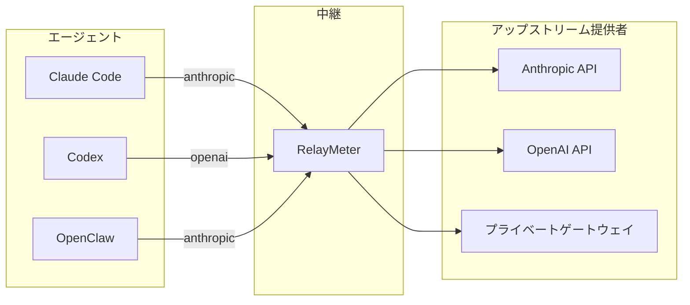

# RelayMeter

[English](README.md) · [简体中文](README.zh-CN.md) · [繁體中文](README.zh-TW.md) · [日本語](README.ja.md) · [한국어](README.ko.md)

<p align="center">
  
    
</p>  
&nbsp;&nbsp; 
<b>すべての AI コーディングエージェントのためのローカル中継。Anthropic / OpenAI 間のプロトコルを相互変換し、すべてのリクエスト・プラットフォーム・アップストリームのトークン使用量を集計します。</b>


**1、トークン集計：**  
&nbsp;&nbsp;中継を通過するすべてのリクエストパケットのトークン使用量を集計。プラットフォーム・モデル・アップストリーム別に消費量を分析できます。
メッセージ本文をローカルデータベースに保存することも可能。  
**2、プロトコル変換：**  
&nbsp;&nbsp;互換性のないクライアントとアップストリームプロバイダーの間でプロトコルを相互変換
（Anthropic Messages、OpenAI Chat Completions、OpenAI Responses を相互に変換）  
**3、リアルタイムストリーム：**  
&nbsp;&nbsp;リアルタイムストリームサイドバーで、実行中の思考プロセスと出力テキストを確認できます。


<p align="center">
  
</p>


## なぜ必要か
**1、複数のエージェント（Claude Code、Codex、OpenClaw……）と複数のモデルプロバイダー（Anthropic、MiniMax、DeepSeek、ollama……）を併用している。
&nbsp;&nbsp;対応プロトコルはそれぞれ異なり、Anthropic 対応のものもあれば OpenAI 対応のものもある。Anthropic 専用のクライアントでは、OpenAI 専用のアップストリームを使えない——
プロバイダー側がリクエストを拒否し、クライアント側もレスポンスを解析できない。  
2、複数のアップストリームとモデルがあり、タスクに応じてモデルやアップストリームを切り替えたい。しかし、あちこちのプラットフォームで設定ファイルを編集するのは面倒。    
3、同じアップストリームプロバイダーを複数のプラットフォームで使い、総トークン消費量を知りたい。しかし、プロバイダー自身のウェブページ以外に、総消費トークンを統一ビューで確認できるツールは存在しない。  
4、多くのエージェントプラットフォームはコーディング中ブラックボックスだ。思考ストリームも、場合によっては本文ストリームも出してくれない。何が出力されているのか、まだ動いているのかフリーズしているのか、まったく見えない。  
5、自分がどれだけトークンを燃やしているかを鑑賞したいだけ。**  

## RelayMeter でできること

**• クリック一つで使いたいモデルに切り替え：**
  

**• プラットフォーム別のトラフィック統計を確認：**  


**• 履歴からメッセージ本文を直接確認**
  

**• 豊富な統計グラフ：**  
  

**• ストリーム状態表示アニメーション**  
  

**• リアルタイムストリームサイドバーを開いて、ストリーミング内容とツール呼び出し情報をリアルタイムに確認**  
    

**• さらに、サイドバー操作用のフローティングボール、パススルーモード、クロスプロトコル変換、ストリームプラットフォーム識別など、多彩で実用的な機能を搭載。**
<br><br>


****

## クイックスタート

### 1. インストール

```bash
git clone https://github.com/<your-org>/relaymeter.git
cd relaymeter
python -m pip install -e .
```

Python 3.11+ 推奨。Windows / macOS / Linux いずれでも動作します。デスクトップ GUI には pywebview 対応のシステム WebView バックエンドが必要です（Windows は WebView2 標準搭載、macOS は WKWebView 標準搭載、Linux は `webkit2gtk-4.1` をインストール）。

### 2. 起動

どちらかをお選びください：

```bash
# デスクトップ GUI（推奨、リキッドガラス調ダッシュボード）
relay-gui

# ヘッドレス（ウィンドウなし）
python main.py serve
```

初回起動時に `127.0.0.1:8088` で待ち受け、`.env` からデフォルトの `upstreams.json` を生成します。このファイルを直接編集するか、空のままにして GUI の設定ページで変更できます。

### 3. 動作確認

```bash
curl http://127.0.0.1:8088/healthz   # → {"ok": true}
curl http://127.0.0.1:8088/stats     # プラットフォーム別トークン総量
curl http://127.0.0.1:8088/live      # 進行中のリクエスト
```
### 4. 中継にモデルプロバイダーを追加  
**アップストリーム -> 新規アップストリーム：**  
    
複数のモデルを作成できます。入力後は Enter で確定してください。

詳細設定（課金 / 倍率 / 上限 / プロトコルアダプター、折りたたみ領域）：

| フィールド | 説明 |
|---|---|
| 課金モード | リクエスト課金 / トークン課金 |
| トークン課金フィールド | `input_tokens`（入力）/ `output_tokens`（出力）/ `cache_read_input_tokens`（キャッシュヒット読み取り）/ `cache_creation_input_tokens`（キャッシュ書き込み） |
| モデル倍率 | 未記載のモデルは 1× として計算 |
| 5h / 週 / 月の上限 | 空欄 = 無制限 |
| OpenCode Go プロトコルアダプター | opencode-go のみ：x-api-key 自動切り替え、モデル小文字化、thinking 除去 |

備考：任意。アップストリーム詳細カードの下部に表示されます。下部の「テスト」「接続テスト」ボタンで、作成前にアップストリームを検証できます。

### 5. エージェントのリクエスト先を中継に向ける
中継には2つのモードがあります：

**変換モード**  
変換モードでは、モデルとアップストリームの選択を中継が完全に制御します。コーディングクライアントからの全リクエストはまず中継に到達し、中継が引き継いで選択したアップストリームへ送信します。クライアント側は URL を中継に向け、api-key とモデルを `auto` プレースホルダーにするだけで構いません。

```
BASE_URL                 = "http://127.0.0.1:8088/anthropic"
BASE_URL                 = "http://127.0.0.1:8088/openai"
AUTH_TOKEN ( Api_Key )   = auto
model                    = auto
```

Deepseek を例に説明します（リクエスト先は公式サイトの情報による）：

| フィールド | 値 |
|---|---|
| base_url (OpenAI) | `https://api.deepseek.com` |
| base_url (Anthropic) | `https://api.deepseek.com/anthropic` |
| api_key | `sk-xxxx`（例） |
| model | `deepseek-v4-flash` / `deepseek-v4-pro` / `deepseek-v4-flash-vision-exp` |

中継を通さない場合のリクエスト（claude code の例）：

```json
{
  "env": {
    "ANTHROPIC_AUTH_TOKEN": "sk-xxxx",
    "ANTHROPIC_BASE_URL": "https://api.deepseek.com/anthropic",
    "API_TIMEOUT_MS": "3000000",
    "CLAUDE_CODE_DISABLE_NONESSENTIAL_TRAFFIC": "1",
    "ANTHROPIC_MODEL": "deepseek-v4-pro"
  }
}
```

中継を通す場合、このリクエストは次のように書き換わります：

```json
{
  "env": {
    "ANTHROPIC_AUTH_TOKEN": "auto",
    "ANTHROPIC_BASE_URL": "http://127.0.0.1:8088/anthropic",
    "API_TIMEOUT_MS": "3000000",
    "CLAUDE_CODE_DISABLE_NONESSENTIAL_TRAFFIC": "1",
    "ANTHROPIC_MODEL": "auto"
  }
}
```

**完全パススルーモード**

パススルーモードでも、トークン集計とデータ保存のためにパケットは中継を経由する必要があるため、base_url は依然として中継を指します。これにより、プロバイダーのアップストリームを指していた url の場所を占有します。この問題の解決策は、**アップストリームの url** と **api_key** の両方を api-key 欄に記述することです：

```
BASE_URL                 = "http://127.0.0.1:8088/anthropic"
BASE_URL                 = "http://127.0.0.1:8088/openai"
AUTH_TOKEN ( Api_Key )   = "アップストリームのアドレス + @@ + Api_Key"
model                    = 実際のモデル
```

中継に到達したパケットは、AUTH_TOKEN ( Api_Key ) を解析し、Api_Key フィールドを「@@」識別子の後半部分の key に書き換えて、前半部分の URL へパケットを送信します。

中継を通す場合、このリクエストは次のように書き換わります：

```json
{
  "env": {
    "ANTHROPIC_AUTH_TOKEN": "sk-xxxx@@https://api.deepseek.com/anthropic",
    "ANTHROPIC_BASE_URL": "http://127.0.0.1:8088/anthropic",
    "API_TIMEOUT_MS": "3000000",
    "CLAUDE_CODE_DISABLE_NONESSENTIAL_TRAFFIC": "1",
    "ANTHROPIC_MODEL": "deepseek-v4-pro"
  }
}
```


### 6. 使い始める
モデルを選択：  
    
使い始める：  
    




## License
MIT — [LICENSE](LICENSE) を参照。
