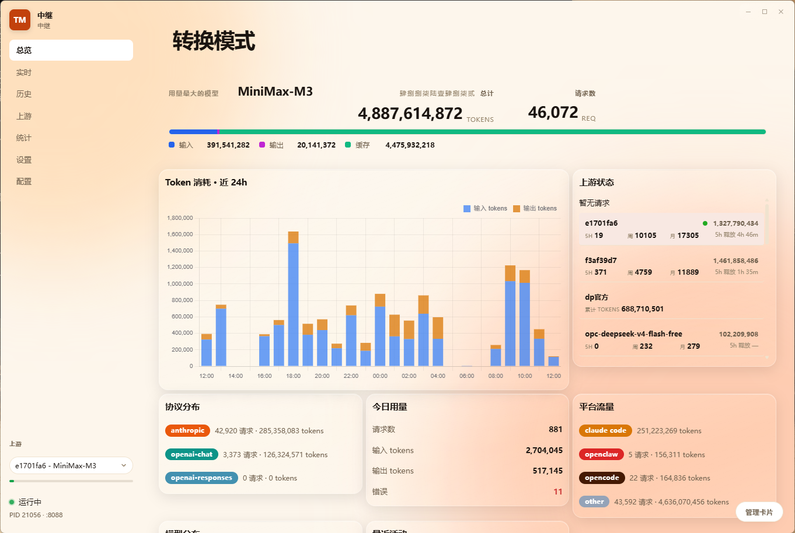
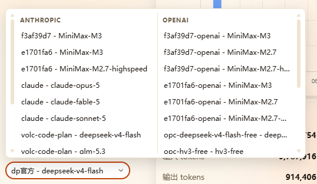
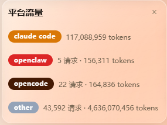
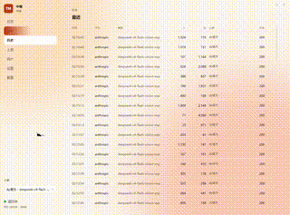
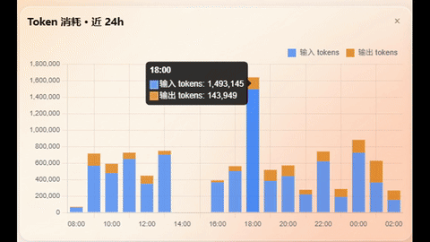
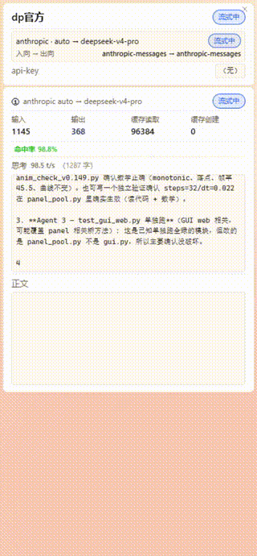
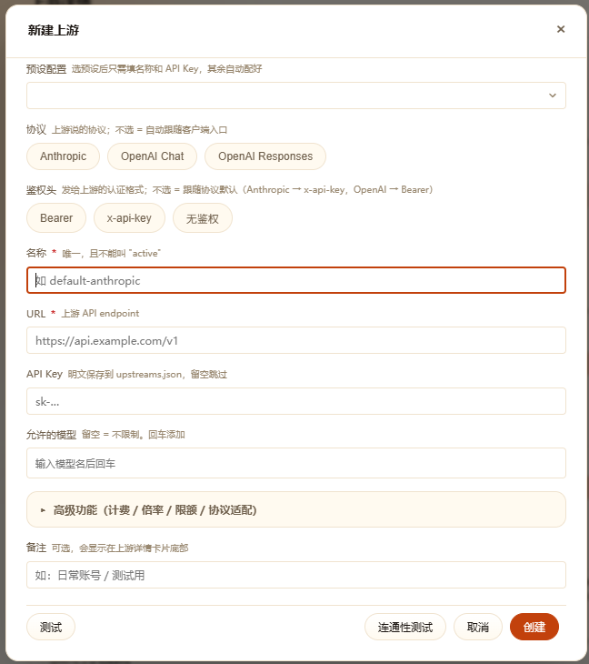
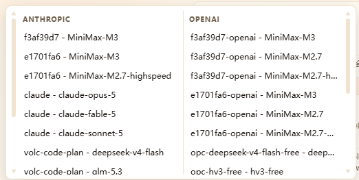
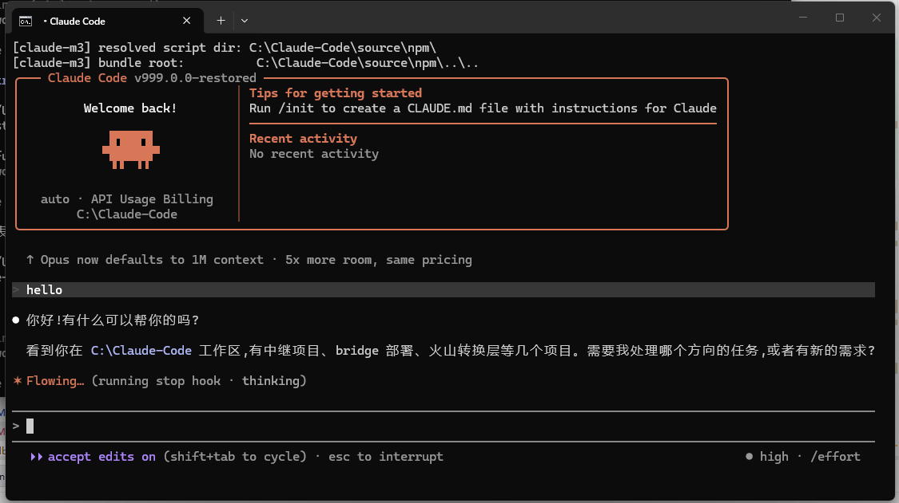
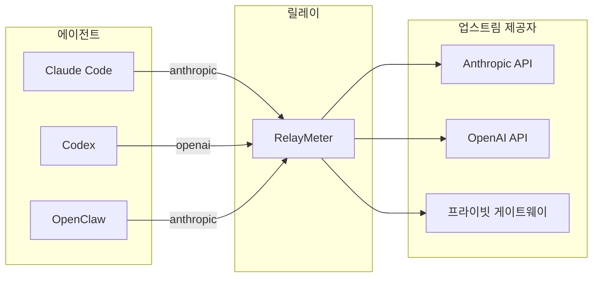

# RelayMeter

[English](README.md) · [简体中文](README.zh-CN.md) · [繁體中文](README.zh-TW.md) · [日本語](README.ja.md) · [한국어](README.ko.md)

<p align="center">
  
    
</p>  
&nbsp;&nbsp; 
<b>모든 AI 코딩 에이전트를 위한 로컬 릴레이. Anthropic / OpenAI 간 프로토콜을 상호 변환하고, 모든 요청·플랫폼·업스트림의 토큰 사용량을 집계합니다.</b>


**1. 토큰 집계:**  
&nbsp;&nbsp;릴레이를 통과하는 모든 요청 패킷의 토큰 사용량을 집계합니다. 플랫폼·모델·업스트림별 소비량을 분석할 수 있고,
메시지 원문을 로컬 데이터베이스에 저장할 수도 있습니다.  
**2. 프로토콜 변환:**  
&nbsp;&nbsp;호환되지 않는 클라이언트와 업스트림 제공자 사이의 프로토콜을 상호 변환합니다
(Anthropic Messages ↔ OpenAI Chat Completions ↔ OpenAI Responses).  
**3. 실시간 스트림:**  
&nbsp;&nbsp;실시간 스트림 사이드바에서 진행 중인 사고 과정과 출력 텍스트 스트림을 확인할 수 있습니다.


<p align="center">
  
</p>


## 왜 필요한가
**1. 여러 에이전트(Claude Code, Codex, OpenClaw……)와 여러 모델 제공자(Anthropic, MiniMax, DeepSeek, ollama……)를 함께 씁니다.
&nbsp;&nbsp;지원 프로토콜이 제각각이라 어떤 것은 anthropic을, 어떤 것은 openai를 지원합니다. anthropic 전용 클라이언트에서는 openai 전용 업스트림을 쓸 수 없습니다——
제공자가 패킷을 거부하고, 클라이언트도 결과를 해석하지 못합니다.  
2. 여러 업스트림과 모델이 있고, 작업에 따라 모델이나 업스트림을 바꾸고 싶지만 여러 플랫폼에서 설정 파일을 일일이 고치는 건 번거롭습니다.    
3. 같은 업스트림 제공자를 여러 플랫폼에서 쓰면서 총 토큰 소비량을 알고 싶습니다. 그런데 제공자가 제공하는 웹페이지 외에는 총 토큰 소비량을 한눈에 보여주는 도구가 없습니다.  
4. 많은 에이전트 플랫폼은 코딩 중에 블랙박스입니다. 사고 스트림도, 경우에 따라 본문 스트림조차 내보내지 않아 무엇이 출력되고 있는지, 아직 돌아가는지 멈춘 건지 알 수 없습니다.  
5. 그저 내가 토큰을 얼마나 태우는지 감상하고 싶습니다.**  

## RelayMeter가 할 수 있는 일

**• 클릭 한 번으로 원하는 모델로 전환:**
  

**• 플랫폼별 트래픽 통계 확인:**  


**• 기록에서 메시지 원문을 바로 확인**
  

**• 풍부한 통계 차트:**  
  

**• 스트림 상태 표시 애니메이션**  
  

**• 실시간 스트림 사이드바를 열어 스트리밍 내용과 도구 호출 정보를 실시간으로 확인**  
    

**• 그 밖에도 사이드바 컨트롤용 플로팅 볼, 패스스루 모드, 크로스 프로토콜 변환, 스트림 플랫폼 식별 등 다양하고 실용적인 기능을 갖췄습니다.**
<br><br>


****

## 빠른 시작

### 1. 설치

```bash
git clone https://github.com/weizhenghub/token-relay.git
cd token-relay
python -m pip install -e .
```

Python 3.11+ 권장. Windows / macOS / Linux 모두 실행됩니다. 데스크톱 GUI는 pywebview가 지원하는 시스템 WebView 백엔드가 필요합니다(Windows는 WebView2 기본 내장, macOS는 WKWebView 기본 내장, Linux는 `webkit2gtk-4.1` 설치).

### 2. 실행

둘 중 하나를 선택하세요:

```bash
# 데스크톱 GUI(권장, 리퀴드 글래스 대시보드)
relay-gui

# 헤드리스(창 없이)
python main.py serve
```

첫 실행 시 `127.0.0.1:8088`에서 대기하며 `.env`에서 기본 `upstreams.json`을 생성합니다. 이 파일을 직접 편집하거나, 비워 둔 채 GUI 설정 페이지에서 변경할 수 있습니다.

### 3. 확인

```bash
curl http://127.0.0.1:8088/healthz   # → {"ok": true}
curl http://127.0.0.1:8088/stats     # 플랫폼별 토큰 총량
curl http://127.0.0.1:8088/live      # 진행 중인 요청
```
### 4. 릴레이에 모델 제공자 연결  
**업스트림 -> 새 업스트림:**  
    
여러 모델을 만들 수 있으며, 입력 후 Enter로 확정합니다.

고급 기능(과금 / 배율 / 한도 / 프로토콜 어댑터, 접힘 영역):

| 필드 | 설명 |
|---|---|
| 과금 모드 | 요청 건수 과금 / 토큰 과금 |
| 토큰 과금 필드 | `input_tokens`(입력) / `output_tokens`(출력) / `cache_read_input_tokens`(캐시 히트 읽기) / `cache_creation_input_tokens`(캐시 쓰기) |
| 모델 배율 | 나열되지 않은 모델은 1×로 계산 |
| 5시간 / 주 / 월 한도 | 비워 두면 = 무제한 |
| OpenCode Go 프로토콜 어댑터 | opencode-go 전용: x-api-key 자동 전환, 모델 소문자화, thinking 제거 |

비고: 선택 사항. 업스트림 상세 카드 하단에 표시됩니다. 하단의「테스트」·「연결 테스트」버튼으로 생성 전에 업스트림을 검증할 수 있습니다.

### 5. 에이전트 요청 주소를 릴레이로 지정
릴레이는 두 가지 모드를 제공합니다:

**변환 모드**  
변환 모드에서는 모델·업스트림 선택을 릴레이가 완전히 제어합니다. 코딩 클라이언트의 모든 요청은 먼저 릴레이에 도달하고, 릴레이가 이를 인계받아 선택한 업스트림으로 전송합니다. 클라이언트는 URL을 릴레이로 지정하고 api-key와 모델을 `auto` 플레이스홀더로 설정하기만 하면 됩니다.

```
BASE_URL                 = "http://127.0.0.1:8088/anthropic"
BASE_URL                 = "http://127.0.0.1:8088/openai"
AUTH_TOKEN ( Api_Key )   = auto
model                    = auto
```

Deepseek를 예로 듭니다(요청 주소는 공식 사이트 정보 기준):

| 필드 | 값 |
|---|---|
| base_url (OpenAI) | `https://api.deepseek.com` |
| base_url (Anthropic) | `https://api.deepseek.com/anthropic` |
| api_key | `sk-xxxx`(예) |
| model | `deepseek-v4-flash` / `deepseek-v4-pro` / `deepseek-v4-flash-vision-exp` |

릴레이를 거치지 않을 때의 요청(claude code 예시):

```json
{
  "env": {
    "ANTHROPIC_AUTH_TOKEN": "sk-xxxx",
    "ANTHROPIC_BASE_URL": "https://api.deepseek.com/anthropic",
    "API_TIMEOUT_MS": "3000000",
    "CLAUDE_CODE_DISABLE_NONESSENTIAL_TRAFFIC": "1",
    "ANTHROPIC_MODEL": "deepseek-v4-pro"
  }
}
```

릴레이를 거칠 때 이 요청은 다음과 같이 바뀝니다:

```json
{
  "env": {
    "ANTHROPIC_AUTH_TOKEN": "auto",
    "ANTHROPIC_BASE_URL": "http://127.0.0.1:8088/anthropic",
    "API_TIMEOUT_MS": "3000000",
    "CLAUDE_CODE_DISABLE_NONESSENTIAL_TRAFFIC": "1",
    "ANTHROPIC_MODEL": "auto"
  }
}
```

**완전 패스스루 모드**

패스스루 모드에서도 토큰 집계와 데이터 저장을 위해 패킷이 릴레이를 거쳐야 하므로 base_url은 여전히 릴레이를 가리킵니다. 이 때문에 원래 제공자 업스트림을 가리키던 url 자리를 차지하게 됩니다. 이 문제의 해결책은 **업스트림 url**과 **api_key**를 모두 api-key 입력란에 적는 것입니다:

```
BASE_URL                 = "http://127.0.0.1:8088/anthropic"
BASE_URL                 = "http://127.0.0.1:8088/openai"
AUTH_TOKEN ( Api_Key )   = "업스트림 주소 + @@ + Api_Key"
model                    = 실제 모델
```

이 패킷이 릴레이에 도달하면 릴레이는 AUTH_TOKEN ( Api_Key )에서 문자를 파싱해 Api_Key 필드를「@@」구분자의 뒷부분 key로 다시 쓰고, 앞부분 URL로 패킷을 전송합니다.

릴레이를 거칠 때 이 요청은 다음과 같이 바뀝니다:

```json
{
  "env": {
    "ANTHROPIC_AUTH_TOKEN": "sk-xxxx@@https://api.deepseek.com/anthropic",
    "ANTHROPIC_BASE_URL": "http://127.0.0.1:8088/anthropic",
    "API_TIMEOUT_MS": "3000000",
    "CLAUDE_CODE_DISABLE_NONESSENTIAL_TRAFFIC": "1",
    "ANTHROPIC_MODEL": "deepseek-v4-pro"
  }
}
```


### 6. 사용 시작
모델 선택:  
    
사용 시작:  
    




## License
MIT — [LICENSE](LICENSE) 참조.
