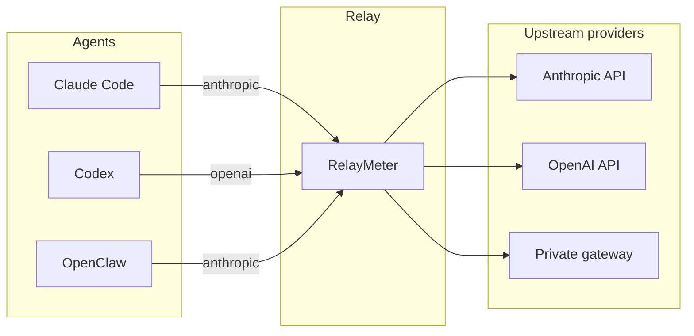

# RelayMeter

[English](README.md) · [简体中文](README.zh-CN.md) · [繁體中文](README.zh-TW.md) · [日本語](README.ja.md) · [한국어](README.ko.md)

<p align="center">
  
  
</p>
&nbsp;&nbsp;
<b>A local relay for all AI coding agents. Translates between Anthropic / OpenAI protocols and meters token usage across every request, platform, and upstream.</b>


**1. Token metering**
&nbsp;&nbsp;Meters the token usage of every request packet passing through the relay. Break down consumption by platform, model, or upstream,
and optionally save raw message bodies to a local database.

**2. Protocol conversion**
&nbsp;&nbsp;Converts between incompatible client and upstream protocols
(Anthropic Messages, OpenAI Chat Completions, OpenAI Responses — any-to-any).

**3. Live streams**
&nbsp;&nbsp;Watch the in-flight thinking and output text streams in the live-stream sidebar.


<p align="center">
  
</p>


## Why you need it
**1. You run several agents (Claude Code, Codex, OpenClaw…) against several model providers (Anthropic, MiniMax, DeepSeek, ollama…).
&nbsp;&nbsp;Their protocols differ — some speak Anthropic, some speak OpenAI. On an Anthropic-only client you can't use an OpenAI-only upstream:
the provider rejects the payload, and the client can't parse the response either.

2. You have multiple upstreams and models, and you want to switch model or upstream per task — without editing config files on a pile of platforms.

3. You use one upstream provider across several platforms and want to know how many tokens it consumed in total. But no tool except the provider's own web page gives you a unified view of total token consumption.

4. Many coding-agent platforms are a black box while coding — they don't expose the thinking stream, sometimes not even the text stream. You can't see what's being produced, or whether it's still running or already hung.

5. You just want to admire how many tokens you can burn.**

## What RelayMeter can do

**• Click to switch to the model you want:**
<p style="margin-left:10%"></p>

**• View traffic stats across platforms:**
<p style="margin-left:10%"></p>

**• Inspect raw message bodies right in history**
<p style="margin-left:10%"></p>

**• Rich charts:**
<p style="margin-left:10%"></p>

**• Stream-status indicator animations**
<p style="margin-left:10%"></p>

**• Open the live-stream sidebar to watch streaming content and tool calls in real time**
<p style="margin-left:10%"></p>

**• Plus a floating-ball sidebar control, passthrough mode, cross-protocol conversion, stream-platform detection, and more.**
<br><br>


****

## Quick Start

### 1. Install

```bash
git clone https://github.com/weizhenghub/relaymeter.git
cd relaymeter
python -m pip install -e .
```

Python 3.11+ recommended. Runs on Windows / macOS / Linux. The desktop GUI needs a pywebview-supported system WebView backend (Windows ships WebView2, macOS ships WKWebView, Linux needs `webkit2gtk-4.1`).

### 2. Launch

Pick one:

```bash
# Desktop GUI (recommended, liquid-glass dashboard)
relay-gui

# Headless (no window)
python main.py serve
```

On first start it listens on `127.0.0.1:8088` and generates a default `upstreams.json` from `.env`. You can edit that file directly, or leave it empty and change it on the GUI settings page.

### 3. Verify

```bash
curl http://127.0.0.1:8088/healthz   # → {"ok": true}
curl http://127.0.0.1:8088/stats     # total tokens per platform
curl http://127.0.0.1:8088/live      # in-flight requests
```
### 4. Link a model provider in the relay
**Upstreams -> New upstream:**
<p style="margin-left:10%"></p>
You can create multiple models; press Enter to confirm each one.

### 5. Point your agents at the relay
The relay offers two modes:

**Conversion mode**
In conversion mode, model and upstream selection are fully controlled by the relay. All requests from coding clients land at the relay first; the relay takes over and forwards them to the upstream selected inside it. On the client side you only need to point the URL at the relay and set api-key and model to the `auto` placeholder.

```
BASE_URL                 = "http://127.0.0.1:8088/anthropic"
BASE_URL                 = "http://127.0.0.1:8088/openai"
AUTH_TOKEN ( Api_Key )   = auto
model                    = auto
```

Using Deepseek as an example (endpoint info from the official docs):

| Field | Value |
|---|---|
| base_url (OpenAI) | `https://api.deepseek.com` |
| base_url (Anthropic) | `https://api.deepseek.com/anthropic` |
| api_key | `sk-xxxx` (example) |
| model | `deepseek-v4-flash` / `deepseek-v4-pro` / `deepseek-v4-flash-vision-exp` |

The request without the relay (using Claude Code):

```json
{
  "env": {
    "ANTHROPIC_AUTH_TOKEN": "sk-xxxx",
    "ANTHROPIC_BASE_URL": "https://api.deepseek.com/anthropic",
    "API_TIMEOUT_MS": "3000000",
    "CLAUDE_CODE_DISABLE_NONESSENTIAL_TRAFFIC": "1",
    "ANTHROPIC_MODEL": "deepseek-v4-pro"
  }
}
```

The same request rewritten through the relay:

```json
{
  "env": {
    "ANTHROPIC_AUTH_TOKEN": "auto",
    "ANTHROPIC_BASE_URL": "http://127.0.0.1:8088/anthropic",
    "API_TIMEOUT_MS": "3000000",
    "CLAUDE_CODE_DISABLE_NONESSENTIAL_TRAFFIC": "1",
    "ANTHROPIC_MODEL": "auto"
  }
}
```

**Full passthrough mode**

In passthrough mode, packets still have to pass through the relay so it can meter tokens and save data, so base_url still points at the relay. This occupies the slot that used to point at the provider upstream. The solution is to write both the **upstream url** and the **api_key** in the api-key field, in this format:

```
BASE_URL                 = "http://127.0.0.1:8088/anthropic"
BASE_URL                 = "http://127.0.0.1:8088/openai"
AUTH_TOKEN ( Api_Key )   = "<upstream url> + @@ + <api_key>"
model                    = <actual model>
```

When the packet reaches the relay, it parses the AUTH_TOKEN ( Api_Key ) field, rewrites the Api_Key field to the key after the `@@` marker, and forwards the packet to the URL in the first half.

The request rewritten through the relay:

```json
{
  "env": {
    "ANTHROPIC_AUTH_TOKEN": "sk-xxxx@@https://api.deepseek.com/anthropic",
    "ANTHROPIC_BASE_URL": "http://127.0.0.1:8088/anthropic",
    "API_TIMEOUT_MS": "3000000",
    "CLAUDE_CODE_DISABLE_NONESSENTIAL_TRAFFIC": "1",
    "ANTHROPIC_MODEL": "deepseek-v4-pro"
  }
}
```


### 6. Start using
Pick a model:
<p style="margin-left:10%"></p>
Start using:
<p style="margin-left:10%"></p>




## License
MIT — see [LICENSE](LICENSE).
