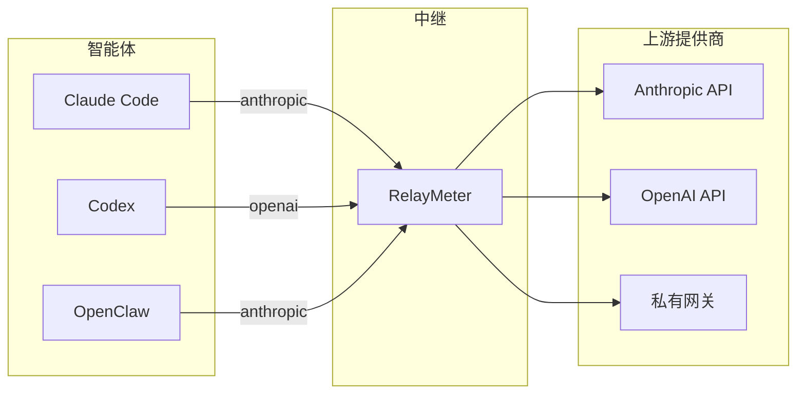

# RelayMeter

[English](README.md) · [简体中文](README.zh-CN.md) · [繁體中文](README.zh-TW.md) · [日本語](README.ja.md) · [한국어](README.ko.md)

<p align="center">
  
    
</p>  
&nbsp;&nbsp; 
<b>面向所有AI 编程智能体的本地中继，在 Anthropic / OpenAI 之间互转协议，统计所有请求、平台和上游的 token 用量。</b>


**1、token统计：**  
&nbsp;&nbsp;统计所有平台过中继的请求包的token用量。可按平台、模型、上游统计消耗。
并可将消息原文保存到本地数据库  
**2、协议转换**：  
&nbsp;&nbsp;在不兼容的平台和上游提供商接受协议之间，进行协议转换
（Anthropic Messages、OpenAI Chat Completions、OpenAI Responses 之间互转）  
**3、实时流**  
&nbsp;&nbsp;在实时流侧栏查看当前正在进行的的思考和输出文本流


<p align="center">
  
</p>


## 为什么需要它
**1、你有好几个智能体（Claude Code、Codex、OpenClaw……），还有好几个模型提供商（Anthropic、MiniMax、DeepSeek、ollama……）。
&nbsp;&nbsp;它们支持的协议各不相同，有些支持anthropic，有些支持openai。在只支持anthropic的平台上，无法使用只支持openai的上游提供商，
提供商不接受这个包，平台也没法解析结果  
2、你有多个上游提供商和多个模型，需要根据不同任务切换到不同的模型或上游，但你不想在一堆平台上改配置文件，很是麻烦    
3、你在多个平台用了一个上游提供商，想统计它总共消耗了多少token，可是除了上游提供的网页，没有任何一个工具能给你一个统一的视图，统计总的 token消耗数量  
4、很多智能体平台在coding时就是个黑箱，思考流、甚至正文流都不放出来，你看不到具体输出了什么，到底是仍在跑还是已经卡死了  
5、单纯想鉴赏一下自己有多能烧token**  

## RelayMeter 能做什么

**• 点点鼠标，直接切换想用的模型：**
<p align="center"></p> /> />  

**• 查看不同平台的流量统计：**  
<p align="center"></p> /> />

**• 在历史中直接查看消息原文**
<p align="center"></p> /> />  

**• 丰富的统计图表：**  
<p align="center"></p> /> />  

**•  流状态指示动画**  
<p align="center"></p> /> />  

**• 开启实时流侧栏，实时查看流式内容以及工具调用信息**  
<p align="center"></p> /> />    

**•  以及侧栏控制悬浮球，透传模式，跨协议转换，流平台识别等更多丰富实用的功能**
<br><br>


****

## 快速开始

### 1. 安装

```bash
git clone https://github.com/weizhenghub/relaymeter.git
cd relaymeter
python -m pip install -e .
```
### 2. 启动

任选其一：

```bash
# 桌面 GUI（推荐，液态玻璃仪表盘）
relay-gui

# 纯后台（无窗口）
python main.py serve
```

首次启动会监听 `127.0.0.1:8088`，并从 `.env` 生成一份默认 `upstreams.json`。你可以直接编辑这份文件或到 GUI 设置页改。

### 3. 验证

```bash
curl http://127.0.0.1:8088/healthz   # → {"ok": true}
curl http://127.0.0.1:8088/stats     # 各平台 token 总量
curl http://127.0.0.1:8088/live      # 正在进行的请求
```
### 4. 在中继里链接模型提供商  
**上游 -> 新建上游：**  
<p align="center"></p> /> />    
可以创建多个模型，输入完毕后请回车确认。

高级功能（计费 / 倍率 / 限额 / 协议适配，折叠区）：

| 字段 | 说明 |
|---|---|
| 计费模式 | 按次数计费 / 按 Token 计费 |
| Token 计费字段 | `input_tokens`（输入）/ `output_tokens`（输出）/ `cache_read_input_tokens`（缓存命中读取）/ `cache_creation_input_tokens`（缓存写入） |
| 模型倍率 | 未列出的模型按 1× 计 |
| 5h 限额 / 周限额 / 月限额 | 留空 = 不限制 |
| OpenCode Go 协议适配 | 仅 opencode-go 用：自动换 x-api-key、模型小写、剥 thinking |

备注：可选，会显示在上游详情卡片底部。底部有「测试」和「连通性测试」按钮，创建前可验证上游。

### 5. 把智能体请求地址指向中继
中继提供两种模式：

**转换模式**  
转换模式下，模型、上游的选择完全由中继控制，来自 coding 客户端的所有请求，由中继接管并向中继里选择的上游发送。客户端配置只需要将 URL 地址指向中继，然后将 api-key 和模型配置为 `auto` 占位符即可。

```
BASE_URL                 = "http://127.0.0.1:8088/anthropic"
BASE_URL                 = "http://127.0.0.1:8088/openai"
AUTH_TOKEN ( Api_Key )   = auto
model                    = auto
```

以 Deepseek 为例（请求地址来自官网信息）：

| 字段 | 值 |
|---|---|
| base_url (OpenAI) | `https://api.deepseek.com` |
| base_url (Anthropic) | `https://api.deepseek.com/anthropic` |
| api_key | `sk-xxxx`（示例） |
| model | `deepseek-v4-flash` / `deepseek-v4-pro` / `deepseek-v4-flash-vision-exp` |

不走中继时的请求填写（以 claude code 为例）：

```json
{
  "env": {
    "ANTHROPIC_AUTH_TOKEN": "sk-xxxx",
    "ANTHROPIC_BASE_URL": "https://api.deepseek.com/anthropic",
    "API_TIMEOUT_MS": "3000000",
    "CLAUDE_CODE_DISABLE_NONESSENTIAL_TRAFFIC": "1",
    "ANTHROPIC_MODEL": "deepseek-v4-pro"
  }
}
```

走中继时，该请求改写为：

```json
{
  "env": {
    "ANTHROPIC_AUTH_TOKEN": "auto",
    "ANTHROPIC_BASE_URL": "http://127.0.0.1:8088/anthropic",
    "API_TIMEOUT_MS": "3000000",
    "CLAUDE_CODE_DISABLE_NONESSENTIAL_TRAFFIC": "1",
    "ANTHROPIC_MODEL": "auto"
  }
}
```

**完全透传模式**

透传模式下，为了统计 token 和保存数据，仍然需要让数据包经过中继，因而 base_url 仍需指向中继。这会占用原本指向提供商上游的 url 的位置，对于此问题的解决办法是：将**上游 url** 和 **api_key** 都写在 api-key 的填写位置，采用如下格式：

```
BASE_URL                 = "http://127.0.0.1:8088/anthropic"
BASE_URL                 = "http://127.0.0.1:8088/openai"
AUTH_TOKEN ( Api_Key )   = "上游地址 + @@ + Api_Key"
model                    = 实际模型
```

此数据包到达中继后，中继会从 AUTH_TOKEN ( Api_Key ) 中解析字符，将 Api_Key 字段重写为「@@」标识符后半部分的 key，然后向前半部分 URL 发送数据包。

走中继时，该请求改写为：

```json
{
  "env": {
    "ANTHROPIC_AUTH_TOKEN": "sk-xxxx@@https://api.deepseek.com/anthropic",
    "ANTHROPIC_BASE_URL": "http://127.0.0.1:8088/anthropic",
    "API_TIMEOUT_MS": "3000000",
    "CLAUDE_CODE_DISABLE_NONESSENTIAL_TRAFFIC": "1",
    "ANTHROPIC_MODEL": "deepseek-v4-pro"
  }
}
```


### 6.开始使用
选择一个模型：  
<p align="center"></p> /> />    
开始使用：  
<p align="center"></p> /> />    




## License

MIT —— 见 [LICENSE](LICENSE)。
