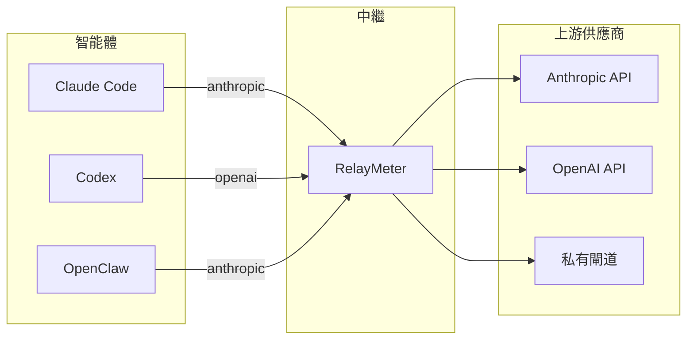

# RelayMeter

[English](README.md) · [简体中文](README.zh-CN.md) · [繁體中文](README.zh-TW.md) · [日本語](README.ja.md) · [한국어](README.ko.md)

<p align="center">
  
    
</p>  
&nbsp;&nbsp; 
<b>面向所有 AI 程式設計智能體的本機中繼，在 Anthropic / OpenAI 之間互轉協定，統計所有請求、平台和上游的 token 用量。</b>


**1、token 統計：**  
&nbsp;&nbsp;統計所有平台過中繼的請求封包的 token 用量。可按平台、模型、上游統計消耗。
並可將訊息原文儲存到本機資料庫  
**2、協定轉換**  
&nbsp;&nbsp;在不相容的平台和上游供應商接受的協定之間，進行協定轉換
（Anthropic Messages、OpenAI Chat Completions、OpenAI Responses 之間互轉）  
**3、即時流**  
&nbsp;&nbsp;在即時流側欄查看目前正在進行的思考和輸出文字流


<p align="center">
  
</p>


## 為什麼需要它
**1、你有好幾個智能體（Claude Code、Codex、OpenClaw……），還有好幾個模型供應商（Anthropic、MiniMax、DeepSeek、ollama……）。
&nbsp;&nbsp;它們支援的協定各不相同，有些支援 anthropic，有些支援 openai。在只支援 anthropic 的平台上，無法使用只支援 openai 的上游供應商，
供應商不接受這個封包，平台也沒法解析結果  
2、你有多個上游供應商和多個模型，需要根據不同任務切換到不同的模型或上游，但你不想在一堆平台上改設定檔，很是麻煩    
3、你在多個平台用了一個上游供應商，想統計它總共消耗了多少 token，可是除了上游提供的網頁，沒有任何一個工具能給你一個統一的視圖，統計總的 token 消耗數量  
4、很多智能體平台在 coding 時就是個黑箱，思考流、甚至正文流都不放出來，你看不到具體輸出了什麼，到底是仍在跑還是已經卡死了  
5、單純想鑑賞一下自己有多能燒 token**  

## RelayMeter 能做什麼

**• 點點滑鼠直接切換到想用的模型：**
 />  

**• 查看不同平台的流量統計：**  
 />

**• 在歷史中直接查看訊息原文**
 />  

**• 豐富的統計圖表：**  
 />  

**• 流狀態指示動畫**  
 />  

**• 開啟即時流側欄，即時查看流式內容以及工具呼叫資訊**  
 />    

**• 以及側欄控制懸浮球、透傳模式、跨協定轉換、流平台識別等更多豐富實用的功能**
<br><br>


****

## 快速開始

### 1. 安裝

```bash
git clone https://github.com/weizhenghub/relaymeter.git
cd relaymeter
python -m pip install -e .
```

推薦 Python 3.11+。Windows / macOS / Linux 都跑得起來，桌面 GUI 需 pywebview 支援的系統 WebView 後端（Windows 自帶 WebView2、macOS 自帶 WKWebView、Linux 裝 `webkit2gtk-4.1`）。

### 2. 啟動

任選其一：

```bash
# 桌面 GUI（推薦，液態玻璃儀表板）
relay-gui

# 純背景（無視窗）
python main.py serve
```

首次啟動會監聽 `127.0.0.1:8088`，並從 `.env` 生成一份預設 `upstreams.json`。你可以直接編輯這份檔案或留空後到 GUI 設定頁改。

### 3. 驗證

```bash
curl http://127.0.0.1:8088/healthz   # → {"ok": true}
curl http://127.0.0.1:8088/stats     # 各平台 token 總量
curl http://127.0.0.1:8088/live      # 正在進行的請求
```
### 4. 在中繼裡連結模型供應商  
**上游 -> 新建上游：**  
 />    
可以建立多個模型，輸入完畢後請按 Enter 確認。

進階功能（計費 / 倍率 / 限額 / 協定配接器，摺疊區）：

| 欄位 | 說明 |
|---|---|
| 計費模式 | 按次數計費 / 按 Token 計費 |
| Token 計費欄位 | `input_tokens`（輸入）/ `output_tokens`（輸出）/ `cache_read_input_tokens`（快取命中讀取）/ `cache_creation_input_tokens`（快取寫入） |
| 模型倍率 | 未列出的模型按 1× 計 |
| 5h 限額 / 週限額 / 月限額 | 留空 = 不限制 |
| OpenCode Go 協定配接器 | 僅 opencode-go 用：自動換 x-api-key、模型小寫、剝離 thinking |

備註：可選，會顯示在上游詳情卡片底部。底部有「測試」和「連通性測試」按鈕，建立前可驗證上游。

### 5. 把智能體請求位址指向中繼
中繼提供兩種模式：

**轉換模式**  
轉換模式下，模型、上游的選擇完全由中繼控制，來自 coding 用戶端的所有請求，由中繼接管並向中繼裡選擇的上游傳送。用戶端設定只需要將 URL 位址指向中繼，然後將 api-key 和模型設定為 `auto` 佔位符即可。

```
BASE_URL                 = "http://127.0.0.1:8088/anthropic"
BASE_URL                 = "http://127.0.0.1:8088/openai"
AUTH_TOKEN ( Api_Key )   = auto
model                    = auto
```

以 Deepseek 為例（請求位址來自官網資訊）：

| 欄位 | 值 |
|---|---|
| base_url (OpenAI) | `https://api.deepseek.com` |
| base_url (Anthropic) | `https://api.deepseek.com/anthropic` |
| api_key | `sk-xxxx`（範例） |
| model | `deepseek-v4-flash` / `deepseek-v4-pro` / `deepseek-v4-flash-vision-exp` |

不走中繼時的請求填寫（以 claude code 為例）：

```json
{
  "env": {
    "ANTHROPIC_AUTH_TOKEN": "sk-xxxx",
    "ANTHROPIC_BASE_URL": "https://api.deepseek.com/anthropic",
    "API_TIMEOUT_MS": "3000000",
    "CLAUDE_CODE_DISABLE_NONESSENTIAL_TRAFFIC": "1",
    "ANTHROPIC_MODEL": "deepseek-v4-pro"
  }
}
```

走中繼時，該請求改寫為：

```json
{
  "env": {
    "ANTHROPIC_AUTH_TOKEN": "auto",
    "ANTHROPIC_BASE_URL": "http://127.0.0.1:8088/anthropic",
    "API_TIMEOUT_MS": "3000000",
    "CLAUDE_CODE_DISABLE_NONESSENTIAL_TRAFFIC": "1",
    "ANTHROPIC_MODEL": "auto"
  }
}
```

**完全透傳模式**

透傳模式下，為了統計 token 和儲存資料，仍然需要讓資料封包經過中繼，因而 base_url 仍需指向中繼。這會佔用原本指向供應商上游的 url 的位置，對於此問題的解決辦法是：將**上游 url** 和 **api_key** 都寫在 api-key 的填寫位置，採用如下格式：

```
BASE_URL                 = "http://127.0.0.1:8088/anthropic"
BASE_URL                 = "http://127.0.0.1:8088/openai"
AUTH_TOKEN ( Api_Key )   = "上游位址 + @@ + Api_Key"
model                    = 實際模型
```

此資料封包到達中繼後，中繼會從 AUTH_TOKEN ( Api_Key ) 中解析字元，將 Api_Key 欄位重寫為「@@」識別符後半部分的 key，然後向前半部分 URL 傳送資料封包。

走中繼時，該請求改寫為：

```json
{
  "env": {
    "ANTHROPIC_AUTH_TOKEN": "sk-xxxx@@https://api.deepseek.com/anthropic",
    "ANTHROPIC_BASE_URL": "http://127.0.0.1:8088/anthropic",
    "API_TIMEOUT_MS": "3000000",
    "CLAUDE_CODE_DISABLE_NONESSENTIAL_TRAFFIC": "1",
    "ANTHROPIC_MODEL": "deepseek-v4-pro"
  }
}
```


### 6. 開始使用
選擇一個模型：  
 />    
開始使用：  
 />    




## License
MIT — 見 [LICENSE](LICENSE)。
