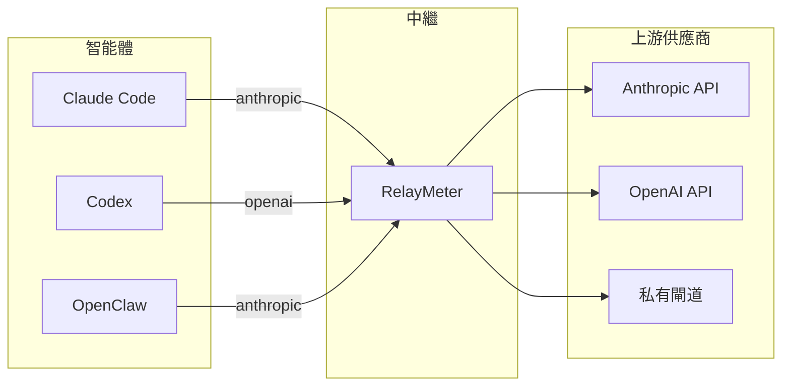

# RelayMeter

[English](README.md) · [简体中文](README.zh-CN.md) · [繁體中文](README.zh-TW.md) · [日本語](README.ja.md) · [한국어](README.ko.md)

<p align="center">
  
  
</p>
&nbsp;&nbsp;


**1、token 統計：**<br>
&nbsp;&nbsp;統計所有平台過中繼的請求封包的 token 用量。<br>
可按平台、模型、上游統計消耗，並可將訊息原文儲存到本機資料庫<br>
**2、協定轉換**<br>
&nbsp;&nbsp;在不相容的平台和上游供應商接受的協定之間，進行協定轉換<br>
（Anthropic Messages、OpenAI Chat Completions、OpenAI Responses 之間互轉）<br>
**3、即時流**<br>
&nbsp;&nbsp;在即時流側欄查看目前正在進行的思考和輸出文字流


<p align="center">
  
</p>


## 為什麼需要它
**1、你有好幾個智能體（Claude Code、Codex、OpenClaw……），還有好幾個模型供應商（Anthropic、MiniMax、DeepSeek、ollama……）。**<br>
&nbsp;&nbsp;它們支援的協定各不相同，有些支援 anthropic，有些支援 openai。在只支援 anthropic 的平台上，無法使用只支援 openai 的上游供應商，<br>
供應商不接受這個封包，平台也沒法解析結果<br>
**2、你有多個上游供應商和多個模型，需要根據不同任務切換到不同的模型或上游，但你不想在一堆平台上改設定檔，很是麻煩**<br>
**3、你在多個平台用了一個上游供應商，想統計它總共消耗了多少 token，可是除了上游提供的網頁，沒有任何一個工具能給你一個統一的視圖，統計總的 token 消耗數量**<br>
**4、很多智能體平台在 coding 時就是個黑箱，思考流、甚至正文流都不放出來，你看不到具體輸出了什麼，到底是仍在跑還是已經卡死了**<br>
**5、單純想鑑賞一下自己有多能燒 token**

## RelayMeter 能做什麼

**• 點點滑鼠直接切換到想用的模型：**
<p style="margin-left:10%"></p>

**• 查看不同平台的流量統計：**
<p style="margin-left:10%"></p>

**• 在歷史中直接查看訊息原文**
<p style="margin-left:10%"></p>

**• 豐富的統計圖表：**
<p style="margin-left:10%"></p>

**• 流狀態指示動畫**
<p style="margin-left:10%"></p>

**• 開啟即時流側欄，即時查看流式內容以及工具呼叫資訊**
<p style="margin-left:10%"></p>

**• 以及側欄控制懸浮球、透傳模式、跨協定轉換、流平台識別等更多豐富實用的功能**
<br><br>


****

## 快速開始

### 1. 安裝

```bash
git clone https://github.com/weizhenghub/relaymeter.git
cd relaymeter
python -m pip install -e .
```

推薦 Python 3.11+。Windows / macOS / Linux 都跑得起來，桌面 GUI 需 pywebview 支援的系統 WebView 後端（Windows 自帶 WebView2、macOS 自帶 WKWebView、Linux 裝 `webkit2gtk-4.1`）。

> **懸浮球 / 即時流側欄視窗（Electron）** —— 懸浮球和即時流側欄是 Electron 渲染視窗，不是 WebView。要啟用它們，clone 後需安裝 Electron 執行環境：

```bash
cd src/relay/electron_app
npm ci          # 或 npm install；把 Electron 二進位下載到 node_modules
cd ../..
```

沒有這一步，主儀表板仍能正常用，但懸浮球和即時流側欄視窗不會出現（中繼日誌會報 `electron.exe not found`）。

### 2. 啟動

任選其一：

```bash
# 桌面 GUI（推薦，液態玻璃儀表板）
relay-gui

# 純背景（無視窗）
python main.py serve
```

首次啟動會監聽 `127.0.0.1:8088`，並從 `.env` 生成一份預設 `upstreams.json`。你可以直接編輯這份檔案或留空後到 GUI 設定頁改。

### 3. 驗證

```bash
curl http://127.0.0.1:8088/healthz   # → {"ok": true}
curl http://127.0.0.1:8088/stats     # 各平台 token 總量
curl http://127.0.0.1:8088/live      # 正在進行的請求
```
### 4. 在中繼裡連結模型供應商
**上游 -> 新建上游：**
<p style="margin-left:10%"></p>
可以建立多個模型，輸入完畢後請按 Enter 確認。

### 5. 把智能體請求位址指向中繼
中繼提供兩種模式：

**轉換模式**
轉換模式下，模型、上游的選擇完全由中繼控制，來自 coding 用戶端的所有請求，由中繼接管並向中繼裡選擇的上游傳送。用戶端設定只需要將 URL 位址指向中繼，然後將 api-key 和模型設定為 `auto` 佔位符即可。

```
BASE_URL                 = "http://127.0.0.1:8088/anthropic"
BASE_URL                 = "http://127.0.0.1:8088/openai"
AUTH_TOKEN ( Api_Key )   = auto
model                    = auto
```

以 Deepseek 為例（請求位址來自官網資訊）：

| 欄位 | 值 |
|---|---|
| base_url (OpenAI) | `https://api.deepseek.com` |
| base_url (Anthropic) | `https://api.deepseek.com/anthropic` |
| api_key | `sk-xxxx`（範例） |
| model | `deepseek-v4-flash` / `deepseek-v4-pro` / `deepseek-v4-flash-vision-exp` |

不走中繼時的請求填寫（以 claude code 為例）：

```json
{
  "env": {
    "ANTHROPIC_AUTH_TOKEN": "sk-xxxx",
    "ANTHROPIC_BASE_URL": "https://api.deepseek.com/anthropic",
    "API_TIMEOUT_MS": "3000000",
    "CLAUDE_CODE_DISABLE_NONESSENTIAL_TRAFFIC": "1",
    "ANTHROPIC_MODEL": "deepseek-v4-pro"
  }
}
```

走中繼時，該請求改寫為：

```json
{
  "env": {
    "ANTHROPIC_AUTH_TOKEN": "auto",
    "ANTHROPIC_BASE_URL": "http://127.0.0.1:8088/anthropic",
    "API_TIMEOUT_MS": "3000000",
    "CLAUDE_CODE_DISABLE_NONESSENTIAL_TRAFFIC": "1",
    "ANTHROPIC_MODEL": "auto"
  }
}
```

**完全透傳模式**

透傳模式下，為了統計 token 和儲存資料，仍然需要讓資料封包經過中繼，因而 base_url 仍需指向中繼。這會佔用原本指向供應商上游的 url 的位置，對於此問題的解決辦法是：將**上游 url** 和 **api_key** 都寫在 api-key 的填寫位置，採用如下格式：

```
BASE_URL                 = "http://127.0.0.1:8088/anthropic"
BASE_URL                 = "http://127.0.0.1:8088/openai"
AUTH_TOKEN ( Api_Key )   = "上游位址 + @@ + Api_Key"
model                    = 實際模型
```

此資料封包到達中繼後，中繼會從 AUTH_TOKEN ( Api_Key ) 中解析字元，將 Api_Key 欄位重寫為「@@」識別符後半部分的 key，然後向前半部分 URL 傳送資料封包。

走中繼時，該請求改寫為：

```json
{
  "env": {
    "ANTHROPIC_AUTH_TOKEN": "sk-xxxx@@https://api.deepseek.com/anthropic",
    "ANTHROPIC_BASE_URL": "http://127.0.0.1:8088/anthropic",
    "API_TIMEOUT_MS": "3000000",
    "CLAUDE_CODE_DISABLE_NONESSENTIAL_TRAFFIC": "1",
    "ANTHROPIC_MODEL": "deepseek-v4-pro"
  }
}
```


### 6. 開始使用
選擇一個模型：
<p style="margin-left:10%"></p>
開始使用：
<p style="margin-left:10%"></p>




## License
MIT — 見 [LICENSE](LICENSE)。
